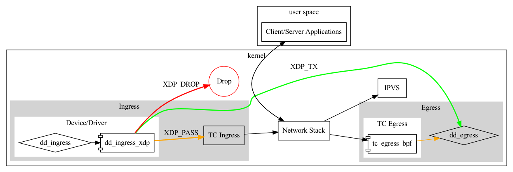
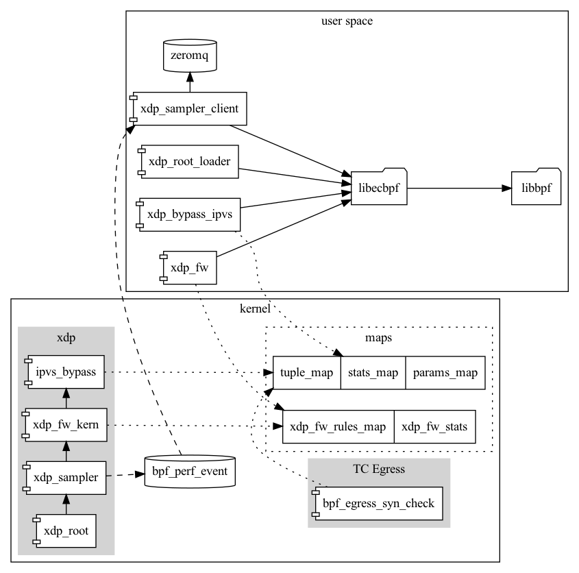

# XDP Architecture 

## Overview

ECBPF is a collection of software used to manage BPF programs primarily around networking and XDP in our software load balancing infrastructure (directors).  

# XDP

XDP, the eXpress Data Path, is a mechanism by which users can insert eBPF programs ahead of the traditional packet processing code. This allows for actions to be performed before the kernel begins allocating space and structures associated with packet processing (e.g. SKBs). This setup also enables communication with user space, allowing a mechanism for moving data in and out of the packet processing space.

XDP is designed as a kernel-based alternative to setups like DPDK, which move packet processing almost entirely into user space. Here, users are still protected by many of the guarantees of kernel space (i.e. they need not do everything themselves, security), while still enabling significant flexibility.

Below is a diagram of the pieces used by ECBPF and how a packet may flow through the kernel. For more info on XDP see [here](https://www.iovisor.org/technology/xdp).

## Architecture

Above is a high level digram of the major software components of ecbpf. It is a mix of eBPF kernel programs, shared libraries and userspace software. The majority of the user space software relies on a shared library [libecbpf](./libecbpf) which in turn relies on [libbpf](./ext/libbpf).

### Root Array

[xdp_root](./xdp_root) allows us to easily organize and control the program flow of xdp programs. There is an associated userspace program, xdp_root, used to attach to network interfaces as well as debug and gather stats about the root array.

### Packet Sampler

[xdp_sampler](./xdp_sampler) a mechanism to export sampled incoming packets and their metadata in a lightweight fastion. We export packets out of the kernel via perf buffer rings using xdp_sampler_client in userspace, send them up to a local message bus (zeromq) and off to backoffice datacenters for uses such as DDoS, monitoring and etc. You can find more info in the [README](./xdp_sampler/README.md).

### Firewall

[xdp_fw](./xdp_fw) is a lightweight firewall primarly used as a frist line of defense against DDoS attacks on directors. The feature set is inclusive of the type of iptables rules that currently can be issues to defend against DDoS. xdp_fw_kern is the XDP program that analyzes packets as they come in using the xdp_fw_rules_map bfp map to make firewall blocking decisions. xdp_fw userspace app is used for controlling the software including inserting rules into the map. More info can be found in the [README](./xdp_fw/README.md).

### ACK Fast Path

ACK Fast Path also known as [bypass_ipvs](./bypass_ipvs) is essentially a mechanism to cache IPVS connection decisions. An eBPF program (bpf_egress_syn_check) sits on the outbound Traffic Contriller (TC) of the kernel watching decisions that IPVS makes in load balancing traffic and recording them into a set of shared maps (tuple_map). On inbound an XDP program program consults these connection entries to load balace existing connections thus shortcircuiting the linux kernel networking stack allowing us to vastily increase the packets per second a given box can handle with pure ipvs. xdp_bypass_ipvs userspace program is used for attaching the software, configuration and stats collection. More info can be found in the [README](./bypass_ipvs/README.md).
